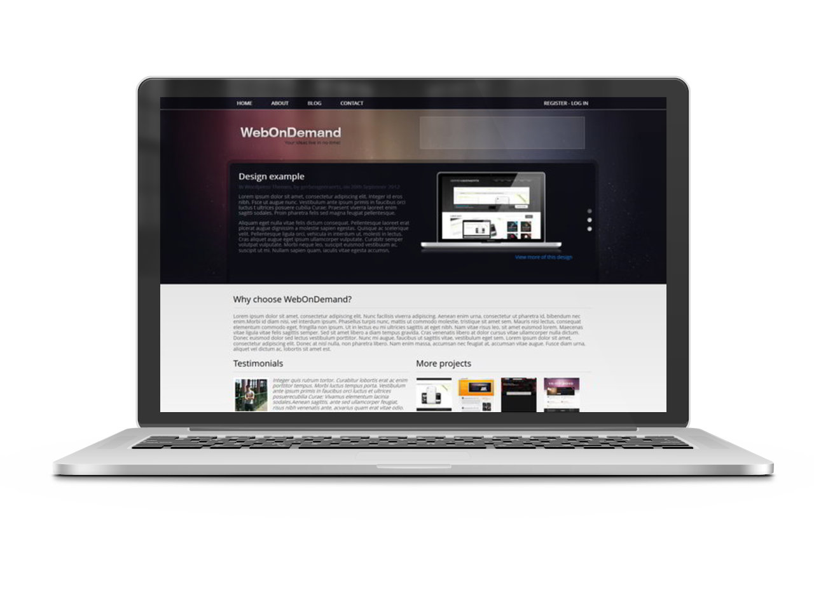

Free webstudio responsive website template
======
Nice website template with main content 1024px max-width
###### Powered by html5, css3 and less css. Also used simple-gs - [fluid less grid](https://github.com/orlovmax/fluid-less-grid)
###### Compatible Browsers: IE8+, Firefox, Chrome, Opera, Safari, Yandex.browser

Demo
------
You can see live demo here: [http://orlovmax.com/freebies/webstudio_website-template](http://orlovmax.com/freebies/webstudio_website-template "webstudio responsive website live demo")

Please note
---
In reset.css most of elements `box-sizing` sets to `border-box`. 

Screenshots
---
**You can see more screenshots [here](screenshots/)**

---

Product mockup created with [http://frame.lab25.co.uk/](http://frame.lab25.co.uk/)